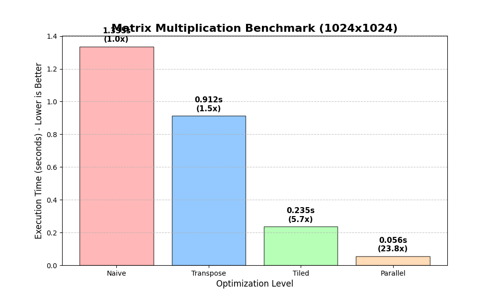

# MatrixBenchmark — High-Performance Matrix Multiplication in C++

A C++ benchmarking engine demonstrating progressive low-latency optimization techniques applied to matrix multiplication. Evolves from a naive baseline to a cache-aware, multithreaded implementation achieving **23.8x speedup** on 1024×1024 matrices.

---

## Performance Results

Benchmarked on Apple M-Series Silicon (8 Cores) with 1024×1024 matrices:

| # | Method | Execution Time | Speedup | Key Technique |
|---|---|---|---|---|
| 1 | Naive | 1.335s | 1.0x | Baseline O(N³) |
| 2 | Transpose | 0.911s | 1.4x | Improved memory layout |
| 3 | Tiled (IKJ) | 0.235s | 5.7x | L1 cache blocking + SIMD auto-vectorization |
| 4 | Parallel | 0.056s | 23.8x | Multithreading via `std::thread` |



---

## Optimization Levels

### 1. Naive Implementation
Standard three-loop approach (i, j, k).

**Bottleneck:** Column-wise access of Matrix B causes severe cache misses — each access jumps non-sequentially through memory, constantly evicting cache lines.

### 2. Transpose Optimization
Matrix B is transposed before multiplication, allowing row-by-row sequential access.

**Improvement:** Sequential memory access pattern reduces cache misses significantly.  
**Limitation:** Transposition overhead limits maximum achievable speedup.

### 3. Tiled + Loop Reordering (Cache-Aware)
Two techniques combined for maximum single-threaded performance:

- **Tiling (Blocking):** Breaks matrices into 64×64 blocks that fit entirely in L1 cache, eliminating slow RAM access during computation.
- **IKJ Loop Order:** Swapping loop order ensures the inner loop accesses memory sequentially, enabling the compiler to emit SIMD (auto-vectorization) instructions — processing multiple elements per CPU cycle.

### 4. Parallel (Multithreaded)
Splits the matrix horizontally across all available CPU cores using data parallelism.

- Implemented with modern C++ `std::thread` and lambda functions
- **Race-condition free** — each thread writes to a distinct memory region of the result matrix, requiring no mutex locks
- Linear scaling with core count on embarrassingly parallel workload

---

## Build & Run

**Prerequisites:**
- C++17 compiler (Clang, GCC, or MSVC)
- CMake 3.10 or higher

```bash
git clone https://github.com/manishpaulish/MatrixBenchmark.git
cd MatrixBenchmark
mkdir build && cd build
cmake ..
make
./benchmark
```

---

## Project Structure

```
MatrixBenchmark/
├── CMakeLists.txt        # Build configuration
├── README.md             # Documentation
├── benchmark_plot.png    # Performance results chart
├── plot_results.py       # Python benchmarking and visualization suite
├── include/
│   └── matrix.h          # Header declarations
└── src/
    ├── main.cpp          # Benchmark runner
    └── matrix.cpp        # Implementation of all 4 algorithms
```

---

## Key Learnings

This project demonstrates that **hardware-aware programming** — understanding cache hierarchy (L1/L2/L3) and CPU vectorization (SIMD) — delivers massive performance gains without changing the underlying O(N³) algorithm.

The 23.8x speedup comes entirely from:
1. Eliminating unnecessary cache misses through tiling and loop reordering
2. Enabling compiler auto-vectorization via sequential memory access patterns
3. Exploiting data parallelism across multiple CPU cores

---

## Author

**Manish Paul** — IIT Kharagpur  
[github.com/manishpaulish](https://github.com/manishpaulish) | [linkedin.com/in/manish-paul-381b72324](https://linkedin.com/in/manish-paul-381b72324)
